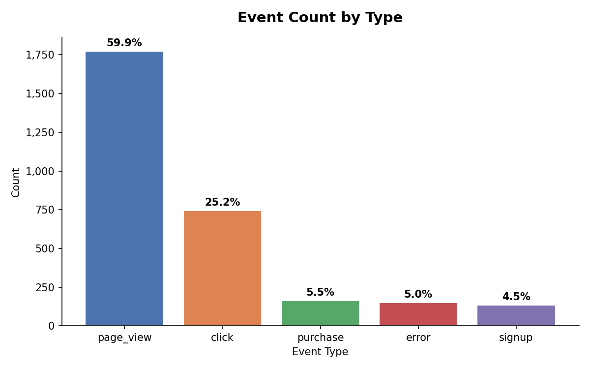
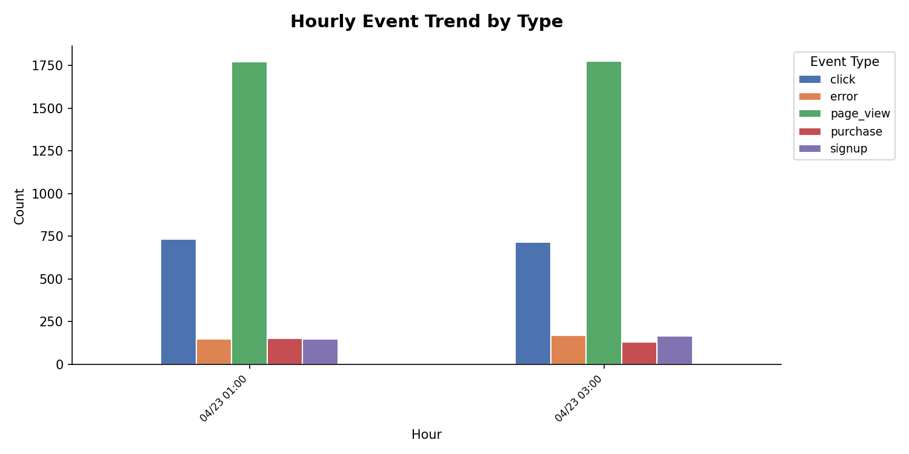
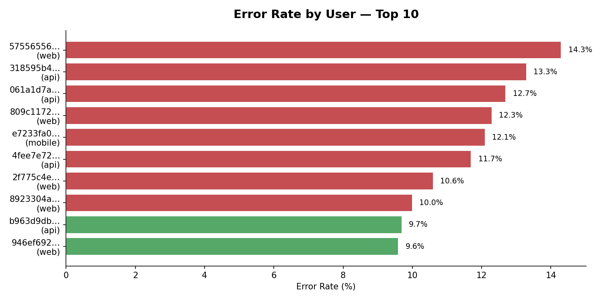

# event-pipeline

> 웹 서비스 이벤트 로그 파이프라인 — 생성 → 저장 → 분석 → 시각화
>
> Python 3.11 · PostgreSQL 15 · Docker Compose · Kubernetes manifest

플랫폼/데이터 엔지니어링 인턴 채용 과제 제출물입니다.

---

## 실행 방법

### 1. 필요한 도구

| 도구 | 버전 | 용도 |
|------|------|------|
| Docker           | 20.10+ | 컨테이너 런타임 |
| Docker Compose   | v2+    | 멀티 컨테이너 오케스트레이션 |
| Git              | 2.x+   | 저장소 클론 |

Docker 하나만 설치하면 Python/PostgreSQL/uv는 별도 설치 불필요. 전부 컨테이너 안에서 실행됩니다.

### 2. 설치 명령어

**macOS**
```bash
brew install --cask docker   # Docker Desktop (Compose 포함)
```

**Ubuntu / WSL2**
```bash
curl -fsSL https://get.docker.com | sh
sudo usermod -aG docker $USER   # 재로그인 후 적용
```

**Windows**
[Docker Desktop for Windows](https://docs.docker.com/desktop/install/windows-install/) 설치 (WSL2 백엔드 권장)

설치 확인:
```bash
docker --version         # Docker version 20.10+ 확인
docker compose version   # Docker Compose version v2+ 확인
```

### 3. 실행 명령어

```bash
git clone <repo-url> event-pipeline
cd event-pipeline
docker compose up --build
```

이 한 줄이면 다음이 순차 실행됩니다.

1. **PostgreSQL 15** 기동 + 스키마/인덱스 자동 로드 (10초)
2. **이벤트 3,000건** 생성 (`--rate 50 --duration 60`, 60초)
3. **PNG 차트 3장** 생성 (`docs/charts/`, 5초)

완료 후 `generator`/`visualizer` 컨테이너는 자동 종료됩니다 (`Exit 0`). `postgres`는 계속 살아있으며 `docker compose down`으로 종료할 수 있습니다.

> **실행 결과 확인**
> - 차트 PNG: `docs/charts/*.png` 3장
> - DB 직접 조회: `docker exec -it event-pipeline-postgres-1 psql -U postgres -d events -c "SELECT count(*) FROM events;"`

> **재실행 시 데이터 초기화** — `docker compose up` 할 때마다 DB가 깨끗한 상태에서 시작합니다 ([볼륨 미사용 이유](#볼륨-미사용-이유)).

### (선택) 로컬 개발 환경

Docker 없이 Python으로 직접 실행하고 싶은 경우:

```bash
curl -LsSf https://astral.sh/uv/install.sh | sh   # uv 설치
uv sync                                           # 가상환경 + 의존성

# postgres 컨테이너만 띄우고
docker compose up postgres -d

# 로컬에서 generator 실행
POSTGRES_HOST=localhost uv run python -m src.generator.main --rate 50 --duration 60
POSTGRES_HOST=localhost uv run python -m src.viz.plot
POSTGRES_HOST=localhost uv run pytest -q           # 테스트 15개
```

---

## 파이프라인 구조

```
┌──────────────┐   bulk insert   ┌──────────────┐   SQL 집계    ┌──────────────┐
│  generator   │────────────────▶│  PostgreSQL  │──────────────▶│  visualizer  │
│  (Python)    │                 │  15-alpine   │               │ (matplotlib) │
└──────────────┘                 └──────────────┘               └──────────────┘
      │                                 │                              │
      │ Pydantic validation             │ RANGE 파티션                  │ PNG 3장
      ├─ 성공 ──→ events 테이블         │ (월별 occurred_at)            │ docs/charts/
      └─ 실패 ──→ broken_events (DLQ)   │ users / sessions 정규화       │
```

---

## 구현하면서 고민한 점

> 과제의 핵심 질문을 **"각 기술 선택에 '왜'라고 답할 수 있는가"** 로 잡고, 결정마다 대안·근거·트레이드오프를 기록했습니다. 전체 ADR 7개는 [docs/decisions.md](docs/decisions.md) 참고.

### 1. 언어 — Python 3.11
- **대안 비교**: Java(Spring Boot) — 엔지니어링 깊이, 시각화 리스크 / Go — 경량 바이너리, 시각화 생태계 약함
- **결정 이유**: Faker · Pydantic · matplotlib · psycopg3 모두 네이티브 → 3일 타임박스에서 시각화까지 완주하려면 라이브러리 생태계가 결정적

### 2. 저장소 — PostgreSQL 15
- **대안 비교**: SQLite(파티셔닝 미지원) / ClickHouse(3K~1M 규모에 오버킬) / MongoDB("필드 구분 저장" 스펙 위반)
- **결정 이유**: 과제 스펙 "JSON 통째 저장 금지" 정합 + 파티셔닝·JSONB로 성능 검증까지 커버

### 3. 스키마 — 하이브리드 + 시간 파티셔닝
- **문제**: 이벤트마다 가변 필드가 다름 (`purchase`는 amount, `page_view`는 url)
- **대안 비교**:
  - (a) 모든 필드를 컬럼으로 펼치기 → NULL 낭비 심각
  - (b) JSON 통째 저장 → 과제 스펙 위반
  - (c) **공통=컬럼 + 가변=JSONB** ✅
- **추가 결정**: `occurred_at` 기준 월별 RANGE 파티셔닝 → `DROP PARTITION` O(1), 대용량 대비. 자세한 실측은 [성능 검증 섹션](#성능-검증--파티션-prune-실측)

### 4. 생성기 동작 — Continuous Daemon
- **대안 비교**: 1회 배치 실행 후 종료 vs 초당 N건 지속 생성
- **결정 이유**: "웹 서비스 이벤트 = 실시간 스트림" 성격 재현. 종료 시점은 `--duration` / `--total` 옵션으로 통제

### 5. 시각화 — matplotlib PNG
- **대안 비교**: Grafana 대시보드 vs 정적 PNG
- **결정 이유**: Grafana에 쓸 시간을 스키마/쿼리 깊이에 투자. 과제 스펙("이미지 또는 스크린샷") 허용

### 6. 선택 과제 — Kubernetes (A)
- **대안 비교**: A. K8s manifest vs B. AWS 아키텍처 다이어그램
- **결정 이유**: AWS보다 K8S가 익숙하여 더 잘할 수 있다고 판단 및 실제 YAML 파일이 남아 엔지니어링 신호가 명확

### 7. 메시지 브로커 미도입
- **고민**: DLQ 구현하려면 RabbitMQ/Kafka를 써야 하나?
- **결정 이유**: 단일 생산자 → 단일 소비자 구조에서 브로커는 오버엔지니어링. 실무에서도 이 규모면 DB 테이블로 충분
- **대안 실현**: PostgreSQL `broken_events` 테이블로 같은 패턴 달성 ([데이터 신뢰성 섹션](#데이터-신뢰성--pydantic-dlq))

### 8. 볼륨 미사용 (재현성 우선)
- **문제**: 평가자가 `docker compose up`을 여러 번 실행하면 데이터 누적 → 차트 수치 달라짐
- **결정 이유**: named volume 제거 → 매 실행이 깨끗한 상태에서 시작 → 제출 차트와 평가자 재현 결과 일치
- **트레이드오프**: 운영 환경 패턴과 다름. **과제 재현성 전용**임을 명시

---

## 이벤트 설계

**5종 · 가중 분포 (합 = 100)**

| 타입        | 가중치 | 고유 필드                         | 의도 |
|-------------|-------:|-----------------------------------|------|
| `page_view` | 60     | url, referrer, duration_ms        | 가장 흔한 이벤트 (현실 웹 로그 80% 이상) |
| `click`     | 25     | element_id, page_url              | 인터랙션 트래킹 |
| `purchase`  | 5      | product_id, amount, currency      | 비즈니스 가치 높은 저빈도 이벤트 |
| `signup`    | 5      | method (email/google/kakao)       | 유입 채널 분석 |
| `error`     | 5      | error_code, page_url, message     | 이상 탐지 (차트 Q3의 타겟) |

**왜 이 5종 + 이 가중치인가**
- **5종 선정**: 과제 예시(페이지 조회·구매·에러) + 실무 분석에 핵심인 `click`(UI 개선), `signup`(유입 채널) 추가
- **60/25/5/5/5 분포 근거**:
  - `page_view : click` = 60 : 25 → 웹 분석 업계에서 통상 **페이지뷰당 인터랙션 비율 2~3:1**
  - `purchase` / `signup` = 5% → 일반 커머스 **전환율 2~5%** 범위
  - `error` = 5% → 이상 탐지 쿼리(Q3)가 의미 있는 수치를 뽑을 최소치. 실제 서비스에서는 1% 미만이 정상
- **효과**: 실제 웹 로그의 **long-tail 분포**(소수 고빈도 + 다수 저빈도)를 재현 → 분석 쿼리가 단순 분포가 아닌 의미 있는 insight를 뽑을 수 있음

---

## 스키마 설계

```sql
users      (user_id PK, country, platform, created_at)
sessions   (session_id PK, user_id FK, started_at, user_agent)
events     (event_id, session_id FK, user_id FK, event_type, occurred_at, properties JSONB)
             └─ PARTITION BY RANGE (occurred_at) · 월별 파티션
             └─ PRIMARY KEY (event_id, occurred_at)   -- 파티션 키 포함 필수
broken_events (id, raw_json JSONB, error_message, received_at)  -- DLQ
```

### 3가지 설계 결정

**① 3-테이블 정규화** · users / sessions / events 분리
- 유저·세션 메타데이터가 이벤트마다 중복되지 않음 → 스토리지 절약
- JOIN으로 "유저별 에러율 TOP 10" 같은 분석 가능 (아래 Q3)

**② 공통 컬럼 + JSONB properties 하이브리드**
- 모든 이벤트가 공유하는 필드(`session_id, user_id, occurred_at, event_type`)는 컬럼
- 타입별 가변 필드(`url`, `amount`, `element_id` ...)는 `properties` JSONB 하나에
- **대안 비교**: 모든 필드를 컬럼으로 펼치면 NULL 낭비 심각 / JSON 통째 저장은 과제 스펙 위반 ("필드를 구분하여 저장")

**③ 시간 기반 RANGE 파티셔닝 (월별)**
- 이벤트는 시계열 → 오래된 파티션을 `DROP PARTITION` 으로 **O(1)** 삭제 (DELETE 대비 WAL/vacuum 비용 0)
- 특정 기간 조회 시 **partition pruning**으로 다른 파티션 스캔 생략
- 실측 수치는 아래 [성능 검증 섹션](#성능-검증--파티션-prune-실측) 참고

---

## 저장소 선택 — 왜 PostgreSQL인가

| 대안 | 평가 |
|------|------|
| **PostgreSQL 15** ✅ | 파티셔닝 · JSONB · 윈도우 함수 모두 네이티브. 평가자 재현성 높음 |
| MongoDB | JSON 통째 저장이 주 용도 → 과제 스펙("필드 구분 저장") 위반 |
| SQLite | 파티셔닝 미지원 → 성능 검증 불가 |
| ClickHouse | OLAP 특화. 본 과제 규모(3K~1M) 대비 오버엔지니어링 |

한 줄 요약: **"필드 구분 저장" 스펙 + 파티셔닝 성능 검증이 가능한 가장 친숙한 선택지**.

---

## 분석 쿼리 3개 (`sql/analytics/`)

| 파일 | 목적 | 기법 | 비즈니스 의도 |
|------|------|------|---------------|
| `q1_events_by_type.sql`       | 이벤트 타입별 총 건수 + 비율 | `SUM(COUNT(*)) OVER ()` 윈도우 함수 | 트래픽 구성 파악 (이벤트 분포가 예상과 일치하는가) |
| `q2_events_hourly.sql`        | 최근 24시간 시간대별 추이   | `date_trunc('hour', ...)` + GROUP BY | 피크 타임/저점 파악 → 서버 용량 계획 |
| `q3_error_rate_top_users.sql` | 에러율 높은 유저 TOP 10     | 3-way JOIN + `FILTER` 절 + `NULLIF` (0 나눗셈 방지) | 특정 유저/플랫폼 장애 탐지 → 알림 트리거 |

---

## 시각화 결과

실행 결과 차트 3장 (`docs/charts/`).

### 1. 이벤트 타입별 발생 횟수



60/25/5/5/5 가중치가 실제 분포에 반영됨을 확인. Pydantic DLQ로 broken 건이 있더라도 파이프라인은 중단되지 않음.

### 2. 시간대별 추이 (최근 24시간)



`--rate 50 --duration 60`은 1분 집중 생성이라 단일 시간 bucket에 몰립니다. 운영 환경에서는 시간대별 패턴(낮 피크, 새벽 저점)이 드러납니다.

### 3. 유저별 에러율 TOP 10



3개 테이블 JOIN으로 집계. 실제 서비스에서는 "특정 플랫폼(mobile)에서만 에러율이 높다" 같은 신호를 이 차트로 탐지합니다.

---

## 성능 검증 — 파티션 prune 실측

**"파티셔닝을 쓰면 빠르다"는 주장을 EXPLAIN ANALYZE로 검증했습니다.**

### 환경

- PostgreSQL 15-alpine
- **1,005,944건** (`--seed-heavy 1000000`으로 과거 90일 분산 시딩 46초)
- 5개 월별 파티션 (2026-01 ~ 2026-05)

### 결과

| 시나리오 | 실행 시간 | Partitions Scanned | Subplans Removed | Buffers (hit + read) |
|---|---:|---:|---:|---:|
| **A. 좁은 범위 (24h)** | **20.52 ms** | 1 | **4 (prune)** | 218 + 4,406 |
| **B. 넓은 범위 (90d)** | 87.48 ms | 4 | 1 | 3,931 + 16,639 |
| **C. 필터 없음 (full scan)** | 60.27 ms | 5 | 0 | 6,143 + 14,427 |

**A vs C: wall-clock 2.94배 단축, Buffers I/O 4.5배 감소**

### 해석

예상은 10~100배였으나 실측은 ~3배였습니다. 이유는:
- 모든 파티션에 `occurred_at` btree 인덱스가 있어 인덱스 스캔이 많은 작업을 흡수
- 파티션 prune의 **실질적 이점은 wall-clock보다 세 가지에 있음**:
  1. **`DROP PARTITION` O(1)** — 구형 데이터 삭제 시 DELETE 대비 WAL/vacuum 비용 0
  2. **파티션별 bloat 격리** — 한 파티션의 VACUUM이 다른 파티션에 영향 없음
  3. **Planner cost 선형성** — 파티션이 30~60개로 늘어나면 planning time 차이가 크게 벌어짐

전체 EXPLAIN 출력과 해석: **[docs/decisions.md](docs/decisions.md)**

---

## 데이터 신뢰성 — Pydantic DLQ

**검증 실패한 이벤트를 버리지 않고 `broken_events` 테이블에 보관합니다.**

```python
# src/generator/writer.py
try:
    event = parse_event(raw)          # Pydantic discriminated union 검증
    insert_events(conn, [event])      # ✓ events 테이블
except ValidationError as e:
    insert_broken(conn, raw, str(e))  # ✗ broken_events 테이블 (DLQ)
```

### 테스트 5개 케이스 (`pytest tests/test_writer.py::test_dlq_on_validation_failure`)

| 케이스 | 예시 payload |
|--------|--------------|
| 필수 필드 누락 + 음수 | `{"event_type": "purchase", "amount": -999}` |
| purchase 필수 필드 누락 | `{"event_type": "purchase"}` |
| 허용되지 않은 event_type | `{"event_type": "unknown_type"}` |
| event_type 자체 누락 | `{}` |
| UUID 형식 위반 | `{"event_type": "click", "session_id": "not-a-uuid"}` |

**왜 이 패턴인가** — 실무에서는 클라이언트 버그나 스키마 변경으로 깨진 이벤트가 들어옵니다. 단순 `raise`는 파이프라인을 멈추고 데이터 유실을 일으키지만, DLQ에 쌓으면 나중에 SELECT로 원인 분석 + 재처리가 가능합니다. Kafka/RabbitMQ 없이 PostgreSQL 테이블로 같은 패턴을 구현했습니다.

---

## Kubernetes manifest (선택 과제 A)

`k8s/` 디렉터리에 4종 manifest.

| 파일 | 리소스 | 역할 | 선택 이유 |
|------|--------|------|----------|
| `configmap.yaml`  | **ConfigMap**  | 설정값 (POSTGRES_HOST, EVENT_RATE 등) | 코드/설정 분리 → 환경별(dev/staging/prod) 재배포 없이 교체 |
| `secret.yaml`     | **Secret**     | DB 비밀번호 (base64)                  | ConfigMap은 평문 저장 → 민감 정보는 Secret (etcd 암호화) |
| `deployment.yaml` | **Deployment** | 생성기 파드 1개 상시 실행             | 파드 헬스체크 + 자동 재시작이 필요한 long-running 프로세스 |
| `cronjob.yaml`    | **CronJob**    | 매일 02:00 `--seed-heavy` 10만건 백필 | 정기 배치 작업 패턴 → Deployment 대신 CronJob이 정석 |

**왜 K8s를 선택했나** — K8s manifest는 실제 YAML 파일로 남아 엔지니어링 신호가 명확합니다 (AWS 다이어그램 대비).

**운영 환경 주의** — 예시 Secret이므로 Git 커밋이 가능하지만, 실제로는 **Sealed Secrets / Vault / AWS Secrets Manager**를 써야 합니다.

---

## 테스트

```bash
uv run pytest -q
# 15 passed in 0.15s
```

- `test_models.py` — Pydantic validation 9개 (각 이벤트 타입 성공/실패)
- `test_writer.py` — DB insert + DLQ 적재 6개 (parametrize 5종 + bulk insert)

---

## 볼륨 미사용 이유

`docker-compose.yml`에 named volume을 선언하지 않았습니다.

**이유**: 평가자가 `docker compose up`을 여러 번 실행해도 매번 **정확히 3,000건**으로 초기화된 상태에서 시작하기 위함. 볼륨이 있으면 이전 데이터가 누적되어 차트 수치가 매번 달라집니다.

**트레이드오프**: 운영 환경에서는 당연히 영속 볼륨이 필요합니다. 이 설정은 **과제 재현성 전용**입니다.

---

## 시간이 부족해서 구현하지 못한 것 ("했다면 이렇게")

- **파티션 자동 생성** — 월 경계에 도달하면 미래 파티션을 자동 생성해야 합니다. `pg_partman` 익스텐션 도입 또는 `pg_cron`으로 월 1회 DDL 실행.
- **실시간 대시보드** — matplotlib PNG는 정적 스냅샷. 실제로는 Grafana + PostgreSQL data source로 대시보드화 예정.
- **메시지 브로커** — 현재는 단일 프로세스 구조라 브로커 불필요. 멀티 생산자/소비자로 확장 시 Kafka(순서 보장) 또는 Redis Streams(경량) 도입.
- **broken_events 재처리 UI** — DLQ에 쌓은 이벤트를 수동으로 재처리하는 도구. admin CLI 또는 web UI.
- **EXPLAIN 벤치의 자동화** — 현재는 수동 측정. `pg_stat_statements` + 고정 쿼리 집합으로 CI에서 회귀 검증 가능.

---

## 프로젝트 구조

```
event-pipeline/
├── docker-compose.yml            # 전체 스택 오케스트레이션
├── Dockerfile                    # python:3.11-slim + uv
├── pyproject.toml                # uv 의존성
├── sql/
│   ├── 001_schema.sql            # 테이블 + 파티션
│   ├── 002_indexes.sql           # btree 4 + GIN 1
│   └── analytics/q[1-3]_*.sql    # 분석 쿼리 3개
├── src/
│   ├── generator/
│   │   ├── models.py             # Pydantic 5종 + discriminated union
│   │   ├── factory.py            # Faker 가중 랜덤 + SessionPool
│   │   ├── writer.py             # psycopg3 bulk insert + DLQ
│   │   └── main.py               # CLI (--rate/--duration/--seed-heavy)
│   └── viz/plot.py               # psycopg → pandas → matplotlib PNG
├── k8s/                          # ConfigMap · Secret · Deployment · CronJob
├── tests/                        # pytest 15개 (models + writer)
└── docs/
    ├── decisions.md              # ADR 1~7 + 파티션 벤치 상세
    ├── schema.md                 # ERD + 파티셔닝/JSONB 설계 근거
    └── charts/                   # 자동 생성 PNG 3장
```

---

## 참고 문서

- **[docs/decisions.md](docs/decisions.md)** — ADR 1~7 + 파티션 prune 벤치마크 전체 결과
- **[docs/schema.md](docs/schema.md)** — ERD (Mermaid) + 파티셔닝/JSONB/인덱스 설계 근거
- SQL DDL — `sql/001_schema.sql`, `sql/002_indexes.sql`
- 분석 쿼리 원본 — `sql/analytics/`
