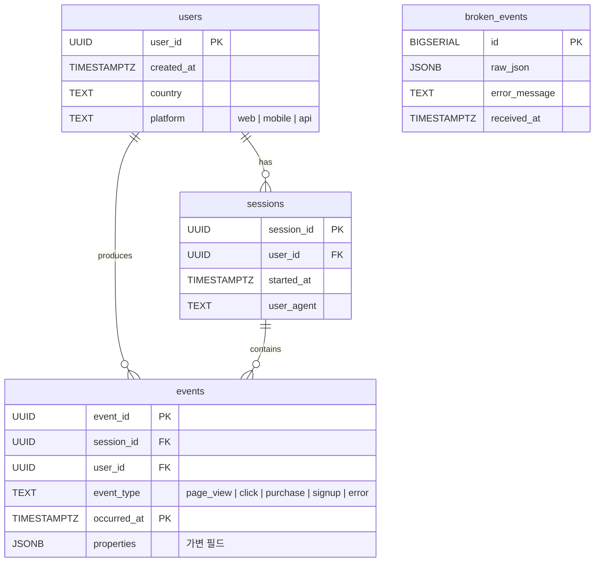

# 스키마 설계

> **목적**: ERD + 테이블별 역할 + 파티셔닝 / JSONB / 인덱스 전략 설명
> 원본 DDL: [`sql/001_schema.sql`](../sql/001_schema.sql) · [`sql/002_indexes.sql`](../sql/002_indexes.sql)

---

## 1. ERD



- `events` 의 PK는 `(event_id, occurred_at)` — 파티션 키(`occurred_at`)를 PK에 포함해야 하는 PostgreSQL 제약 때문
- `broken_events` 는 Dead Letter Queue 역할로 다른 테이블과 관계 없음 (의도적 고립)

---

## 2. 테이블 역할

| 테이블 | 행 수 (예상) | 역할 | 수명 |
|--------|-------------:|------|------|
| `users`          | 수~수백  | 유저 메타데이터 (country, platform) | 영구 |
| `sessions`       | 수백~수천 | 세션 단위 (user_agent, started_at) | 영구 |
| `events`         | 수천~수백만 | 이벤트 스트림 (파티션) | 시계열, 구형 파티션 DROP 가능 |
| `broken_events`  | 소량       | 검증 실패 이벤트 (DLQ) | 재처리/분석 후 정리 |

---

## 3. 왜 이렇게 설계했는가

### 3-1. 3-테이블 정규화 (users / sessions / events)

**문제**: 모든 이벤트에 user country, platform, user_agent 같은 메타데이터를 포함시키면 중복 발생

**대안 비교**

| 방식 | 스토리지 | 분석 유연성 | 선택 |
|------|---------|-------------|------|
| 단일 테이블 (events에 모든 필드) | ❌ 중복 심각 | ✅ JOIN 불필요 | — |
| **3-테이블 정규화** | ✅ 중복 제거 | ✅ JOIN으로 자유로운 집계 | ✅ |
| 4-테이블+ (properties도 쪼개기) | 과도 | ❌ 스키마 변경 비용 | — |

**결과**: Q3(유저별 에러율 TOP 10) 같은 분석이 `users ⨝ sessions ⨝ events` 3-way JOIN으로 자연스럽게 나옴.

### 3-2. 공통 컬럼 + JSONB properties 하이브리드

**문제**: 이벤트 타입별로 필드가 다름.
- `page_view` → `url`, `referrer`, `duration_ms`
- `purchase` → `product_id`, `amount`, `currency`
- `error` → `error_code`, `message`

**대안 비교**

| 방식 | 문제 |
|------|------|
| (a) 모든 필드를 컬럼으로 펼치기 | `click`에서 `amount` = NULL, `purchase`에서 `url` = NULL → NULL 낭비 심각. 필드 추가 시 ALTER TABLE |
| (b) JSON 통째 저장 | **과제 스펙 위반** ("필드를 구분하여 저장") |
| (c) **공통=컬럼 + 가변=JSONB** ✅ | 쿼리 가능한 공통 필드는 타입 보장, 가변 필드는 유연. GIN 인덱스로 JSONB 쿼리도 빠름 |

**공통 컬럼** (모든 이벤트 공유): `event_id`, `session_id`, `user_id`, `event_type`, `occurred_at`
**가변 필드** (JSONB): 타입별 고유 필드 전부 → `properties` 컬럼 하나

**JSONB 쿼리 예시**
```sql
-- properties에서 특정 URL 조회 (GIN 인덱스 활용)
SELECT COUNT(*) FROM events
WHERE event_type = 'page_view'
  AND properties @> '{"url": "/home"}';
```

### 3-3. 시간 기반 RANGE 파티셔닝 (월별)

**문제**: 이벤트는 시계열 데이터 → 시간이 지나면 테이블이 무한히 커짐. 1년 후 `DELETE FROM events WHERE occurred_at < ...` 로 지우려 하면:
- WAL 로그 폭증
- AUTOVACUUM 부담
- 삭제 중 테이블 락 경합

**대안 비교**

| 방식 | 구형 데이터 삭제 | 특정 기간 조회 | 선택 |
|------|-----------------|---------------|------|
| 단일 테이블 + INDEX | DELETE (무거움) | INDEX SCAN | — |
| **RANGE 파티션 (월별)** | `DROP PARTITION` O(1) | partition pruning + INDEX | ✅ |
| HASH 파티션 | 구형 삭제 어려움 | 쓰기 분산에 유리 | 적합 안 함 |

**현재 파티션 구성 (`sql/001_schema.sql`)**

```
events_2026_01, events_2026_02, events_2026_03, events_2026_04, events_2026_05
```

- 5개월치 선제 생성 (seed-heavy가 최근 90일 분산이라 과거 파티션 필요)
- 운영 환경에선 `pg_partman` 또는 `pg_cron`으로 매월 자동 생성 필요 ([시간 부족 섹션](../README.md#시간이-부족해서-구현하지-못한-것-했다면-이렇게))

**partition pruning 실측**
- 좁은 24h 쿼리: **1개 파티션만 스캔** (4개 prune)
- 자세한 EXPLAIN ANALYZE 결과: [`decisions.md`](decisions.md)

### 3-4. Dead Letter Queue (`broken_events`)

**문제**: Pydantic validation 실패 이벤트를 `raise` 하면 파이프라인 중단 + 데이터 유실.

**대안 비교**

| 방식 | 단점 |
|------|------|
| `raise ValidationError` | 전체 파이프라인 중단 |
| `logger.warn()` 후 skip | 데이터 영구 유실, 디버깅 불가 |
| **`broken_events` 테이블 적재** ✅ | 원본 JSON 보존, 재처리 가능, 에러 메시지 포함 |
| RabbitMQ/Kafka DLQ | 단일 프로세스 구조에서 오버엔지니어링 |

**스키마 구조**
```sql
broken_events (id, raw_json JSONB, error_message TEXT, received_at TIMESTAMPTZ)
```

`raw_json` 을 원본 그대로 보존하므로, 나중에 스키마 버그 수정 후 재처리 가능.

---

## 4. 인덱스 전략

| 인덱스 | 컬럼 | 용도 |
|--------|------|------|
| `idx_events_event_type`  | `event_type`  | Q1 (타입별 집계) |
| `idx_events_occurred_at` | `occurred_at DESC` | Q2 (시간대별 집계) · 최신 이벤트 조회 |
| `idx_events_user_id`     | `user_id`     | Q3 (유저별 집계) |
| `idx_events_properties`  | `properties` (GIN) | JSONB 내부 필드 조회 |
| `idx_broken_received_at` | `received_at DESC` | DLQ 최근 적재 조회 |

**파티션 인덱스 특성**: PostgreSQL은 파티션된 테이블에 `CREATE INDEX` 하면 각 파티션에 자동으로 인덱스가 만들어집니다. `events_2026_04` / `events_2026_05` 등 모든 파티션에 동일한 4개 인덱스 존재.

---

## 5. 제약 조건

- `users.platform` CHECK: `web | mobile | api` 3종만 허용
- `events.event_type` CHECK: 5종(`page_view | click | purchase | signup | error`)만 허용
- `events` FK: `session_id → sessions`, `user_id → users` (참조 무결성)
- `events.occurred_at NOT NULL` + 기본값 `now()` (파티션 키 누락 방지)

---

## 참고
- ADR 전체 맥락 → [`decisions.md`](decisions.md)
- SQL 원본 → [`sql/001_schema.sql`](../sql/001_schema.sql) · [`sql/002_indexes.sql`](../sql/002_indexes.sql)
